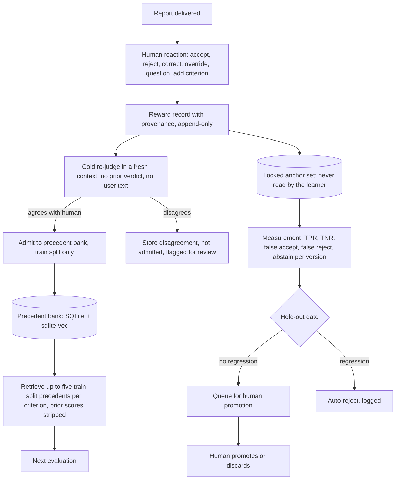

# Learning loop: adapting locally from human reactions

Status: design, 2026-09-14. Not implemented. Decisions: [decision 0014 precedent bank](../decisions/0014-adaptive-learning-precedent-bank.md), [decision 0017 RSI governance](../decisions/0017-rsi-governance-human-promote.md), [decision 0015 pilot and labeling](../decisions/0015-pilot-cases-and-labeling.md). Research: [adaptive skills memo](../research/2026-09-14-adaptive-skills.md), [evaluator learning memo](../research/2026-09-14-evaluator-learning.md), [integrity and RSI memo](../research/2026-09-14-integrity-and-rsi.md). All sources accessed 2026-09-14. Items marked **proposal** were not decided by the maintainer.

## Purpose and governing principle

The maintainer asked for a skill that learns from the user's questions and corrections and improves accuracy locally, and stated that the most important thing is to keep the human reaction as the signal, in the sense of reinforcement learning from human feedback. Two constraints shape the design. First, an evaluator that learns from one user can learn to please that user: memory-evolving agents in the Misevolution study lost 45% of their refusals and learned that a particular action correlated with positive feedback (Shao et al., ICLR 2026, <https://arxiv.org/abs/2509.26354>), and a follow-up rebuttal flips judge verdicts 56 to 86% of the time (Kim and Khashabi, EMNLP 2025 Findings, <https://arxiv.org/abs/2509.16533>). Second, run-time reflection does not help: on subjective evaluation tasks it has negative information gain (Tao et al., 2026-07-31, <https://arxiv.org/abs/2607.28908>), and repeated sampling beats self-refinement at equal cost. Accuracy therefore comes from external evidence entering the context, and human reaction is treated as ground truth that is captured faithfully and then admitted carefully.

## Overview

## Reward records

Every human reaction is a first-class record. Nothing is inferred from silence.

| Reaction | Captured fields | May change | Must not change |
| --- | --- | --- | --- |
| Accept a result | report ID, criterion ID, timestamp | Dev and test statistics | Examples, contract |
| Reject a result, no rationale | as above plus `reason: none` | Dev and test counts only; excluded from the example pool because unreasoned pushback is the strongest sycophancy trigger | Examples, thresholds, contract |
| Correction with rationale | original result, corrected result, rationale text, evidence the user pointed to | Enters admission (cold re-judge) | Contract, anchors |
| Override of overall status | old and new status, rationale if any | Statistics; flagged for review | Everything else |
| Question ("why did you say X?") | question text, the criterion or observation asked about, the answer given | Nothing automatic; the criterion is flagged for clarification in the next contract review | Verdicts, examples |
| Added criterion | text, source, applicability | Becomes a candidate project rule in the later rule ladder | The trusted contract |
| Promote or discard a candidate change | candidate ID, decision, rationale | The active version of the learned material | The anchor set |

Until the core can write these records, the skill appends each reaction to a reactions file beside the report: one JSON object per line with `report_id`, `criterion`, `reaction`, and `note`. That file is the hand-written precursor of the reward record, not a substitute for it; nothing reads it automatically until the core gains the command in Stage 4.

Every record carries provenance: report ID, artifact revision, criterion ID, v-eval version, skill revision, host CLI and model if exposed, timestamp, and a content hash of the case. Records are append-only. The pattern of binary labels plus rationale follows every shipped judge-alignment product examined: LangSmith Align Evals (2025-07-29, <https://www.langchain.com/blog/introducing-align-evals>), Braintrust human review (2026-05-21, <https://www.braintrust.dev/blog/human-review-golden-datasets>), AlignEval (2024-10, <https://eugeneyan.com/writing/aligneval/>), and the Husain and Shankar FAQ (updated 2026-09-01, <https://hamel.dev/blog/posts/evals-faq/>).

## Storage

The precedent bank is local. **Proposal** for the concrete stack: one SQLite database per project under the project's `.v-eval/` directory (already gitignored), with `sqlite-vec` for vectors (<https://github.com/asg017/sqlite-vec>, pre-1.0, so the version is pinned) and embeddings from a local ollama model such as `nomic-embed-text`; the embedder name and dimension are stored with every vector, and changing the embedder forces a full re-embed. Raw reactions never leave the machine. A global bank is not created in the first release; ECC's instinct system separates project and global scopes for the same reason (<https://github.com/affaan-m/everything-claude-code/blob/main/skills/continuous-learning-v2/SKILL.md>).

Row shape, **proposal**: `precedent_id`, `case_hash`, `criterion_id`, `artifact_kind`, `excerpt` (the minimal hunk or passage), `human_result`, `human_rationale`, `original_result`, `cold_rejudge_result`, `split`, `created_at`, `last_used_at`, `use_count`, `embedder`, `vector`, `provenance` (JSON).

## Admission: cold re-judge

A correction becomes an example only after a cold re-judge: the same case is evaluated in a fresh context that contains neither the original verdict nor any of the user's text. If the cold result agrees with the human correction, the case is admitted to the train split. If it disagrees, the disagreement is stored and the case is not admitted; it is surfaced for the maintainer to look at. This step exists because a visible prior score blocks 48% of corrections and flips 10% of correct labels (Kapetanovic et al., CIKM 2026, <https://arxiv.org/html/2608.25869>), and because preference data rewards sycophancy (Sharma et al., ICLR 2024, <https://arxiv.org/abs/2310.13548>). Admission also requires a content-hash and near-duplicate check so the pool does not fill with clones of one case.

## Retrieval at evaluation time

For each criterion, the core retrieves at most five admitted precedents from the train split by embedding similarity of criterion plus excerpt, strips any prior score or verdict text, and presents them to the assistant as worked examples with the human rationale. Five annotated examples per criterion lifted three of four ollama-class judges by 5 to 12 points and hurt one (Dussert, govllm, 2026-05-23, <https://arxiv.org/abs/2605.24737>, n about 44), so retrieval is enabled per host model only after the measurement step below shows a gain for that model. Retrieval never touches the anchor set or the test split.

## Splits and the locked anchor set

Every labeled case is assigned to train, dev, or test deterministically by hash at creation, 20/40/40 (**proposal**, from the Husain and Shankar ranges of 10 to 20 percent train, 40 to 45 dev, 40 to 45 test). The test split plus additional cases form the locked anchor set. The learner never reads it: not for retrieval, not for tuning, not for promotion decisions. Only the measurement step reads it, and only to score. This is the one rule every 2026 self-improvement study converged on: Zhang et al. keep a locked test set "never read by any loop" and show that removing it collapses the metric into a vacuous detector (2026-07-14, <https://arxiv.org/html/2607.12790v1>); Nakajima's Regimes ladder shows in-sample gains of +0.18 collapsing to +0.04 held-out (2026-06-08, <https://arxiv.org/pdf/2606.10241>); Li's DriftJudge uses a frozen human anchor set to attribute drift to the judge rather than the system, catching 60 of 60 silent version bumps (2026-06-13, <https://arxiv.org/abs/2606.15474>). The anchor set is stored encrypted at rest with a canary item whose perfect score would prove leakage, following Anthropic's BrowseComp mitigations (2026-03-06, <https://www.anthropic.com/engineering/eval-awareness-browsecomp>).

## What the learner may never touch

The contract is immutable to the learner: criteria semantics, the verdict enum, the acceptance rule, and the evidence-shape rule are hashed, read-only files. Learned material is data with provenance, versioned separately, and never merged into the contract. This preserves the requirement that weakening the evaluator must not count as improving the artifact.

## Rule ladder, later phase

Once the anchor set exceeds roughly fifty cases (**proposal**; PROCTOR skips held-out gating under twenty cases, <https://arxiv.org/html/2609.02246>), added criteria and repeated corrections can become candidate rules: `criterion`, `trigger`, `path glob`, `confidence`, `evidence[]`. A rule becomes active only after three agreeing signals and no regression on the anchor set, is auto-disabled on two later negative signals, and is appended to a versioned project-local criteria file, never to the trusted contract. Precedence at evaluation time is contract, then active project rule, then retrieved example, with a contradiction check at write time. This mirrors Cursor Bugbot's candidate, active, disabled lifecycle (2026-04-08, <https://cursor.com/blog/bugbot-learning>) and CodeRabbit's rule that path instructions precede learnings (<https://docs.coderabbit.ai/knowledge-base/learnings>).

## Measurement

Before any learned material is promoted, and on every v-eval version, the core re-scores the anchor set and the test split and reports, with denominators: true-positive and true-negative rate per criterion family, false acceptance, false rejection, abstention (UNKNOWN and ERROR) rate, and decided-case accuracy paired with abstention. Paired before-and-after comparisons use McNemar's test; at fifty cases a Wilson interval on a rate is about plus or minus eleven points, so sub-ten-point changes are reported as unproven. Reporting corrections for judge error follow Lee et al. (2025-11, <https://arxiv.org/abs/2511.21140>). For small local models, an abstention threshold is calibrated per criterion on the dev split so the error among non-abstained results stays under a stated bound (Badshah et al., 2026-08-18, <https://arxiv.org/html/2608.17994>).

## Governance of the self-improvement loop

The maintainer chose auto-propose, auto-reject, human-promote ([decision 0017](../decisions/0017-rsi-governance-human-promote.md)). A run may be scheduled or manual, carries a hard token and time budget, evaluates v-eval's own change with the same checker, and may only discard candidates that fail the held-out gate. Survivors are queued with their anchor deltas and at least three seeded runs; the human promotes or discards, and that reaction is itself a reward record. Every propose, reject, promote, and discard is an append-only audited event. Automatic promotion is reconsidered only after the anchor set exceeds about one hundred labels (**proposal**). The human reaction remains the ground truth for the loop; the anchor set exists to measure whether human-driven changes improved revealed-information accuracy, not to replace the human.

## Failure modes this design guards against

| Failure | Guard |
| --- | --- |
| Learning to please the user | Cold re-judge; unreasoned pushback excluded from examples |
| Anchoring on prior verdicts | Prior scores stripped from retrieved examples |
| In-sample gains that vanish held-out | Locked anchor set; deterministic splits at birth |
| Evaluator drift misattributed to the artifact | Anchor re-scoring per version |
| Unattended ratchet | Human promotion; append-only log; budgets |
| Learned rules editing the oracle | Contract immutable to the learner |
| Small-model overconfidence | Calibrated abstention emitting UNKNOWN |

## Open proposals

- The 20/40/40 split, the fifty-case threshold for the rule ladder, and the one-hundred-label threshold for automatic promotion are proposals.
- Whether reactions from a harness (for example evolve-loop's audit verdict) count as human reactions or as a separate signal class is undecided.
- The concrete SQLite schema and the embedding model are proposals.
