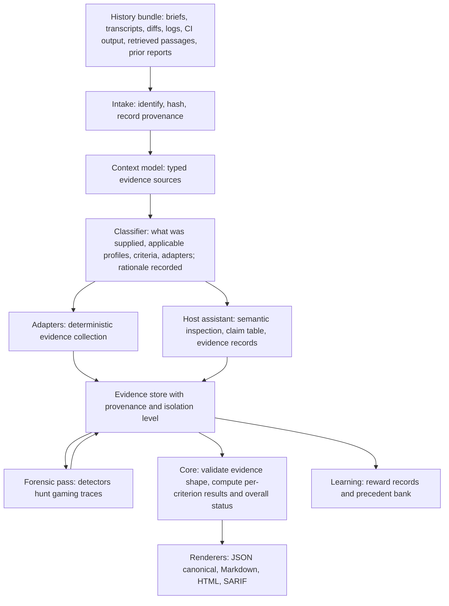

# Pipeline: from any supplied history to a report

Status: design, 2026-09-14. Not implemented. Decisions: [decision 0009 classifier](../decisions/0009-deterministic-intake-classifier.md), [decision 0010 adapters](../decisions/0010-first-adapters.md), [decision 0011 isolation](../decisions/0011-graded-isolation-detective-stance.md), [decision 0012 detectors](../decisions/0012-forensic-detectors-v1.md), [decision 0013 evaluator-not-auditor](../decisions/0013-evaluator-not-auditor.md), [decision 0016 no separate judge](../decisions/0016-no-separate-judge-v1.md). Items marked **proposal** were not decided by the maintainer.

## Purpose

The maintainer's direction was to stop thinking of evaluation as a code-only pipeline: the input is all the history data received, tests and test results are one adapter among several, and an abstraction layer generalizes the context while a classifier decides which criteria and adapters apply. The goal of a run is to collect all the information available and reflect what is hidden underneath it; verdicts are derived afterwards and never suppress an observation.

## Division of labor

Two parties participate in every run, and the boundary between them is the main trust boundary of the design.

- **The host assistant** (Claude Code, Codex, Gemini CLI, Antigravity, Hermes, or an ollama-backed agent running the skill) performs semantic inspection: it reads the artifact and the history, opens files, quotes passages, enumerates the candidate's claims, and writes evidence records. It proposes; it does not decide.
- **The core** (a Go binary, [decision 0005](../decisions/0005-go-core-binary.md)) validates the shape of every evidence record, runs deterministic adapters and detectors, computes per-criterion results and the overall status from the documented policy, and renders reports. It decides; it does not interpret prose.

This split follows the integrity research: in-band judge defenses were bypassed above 90% under adaptive attack, and only deterministic, out-of-band enforcement held ([research memo](../research/2026-09-14-integrity-and-rsi.md)). It also follows evolve-loop's own lesson that verdicts derived by grepping prose drift silently ([local prior art](../research/2026-09-14-local-prior-art.md)).

## Overview



## Stages

| Stage | Input | Output | Who runs it | Trust boundary |
| --- | --- | --- | --- | --- |
| Intake | Paths, diffs, logs, transcripts, URLs, prior reports supplied by the user or a harness | Content-addressed bundle: each item with kind, hash, size, origin, timestamp, and whether it was authored by the candidate | Core | Everything supplied is data. Instructions found inside items never reach the classifier as instructions. |
| Context model | Bundle | Typed evidence sources (see table below) with relationships (diff touches file, log claims revision, transcript references brief) | Core, with the assistant filling typed fields it can read | Candidate-authored items are tagged as such and can never be promoted to trusted context. |
| Classifier | Context model, versioned perspective profiles, the contract if one was supplied | Applicable criteria with IDs, selected perspectives, runnable adapters, skipped adapters with reasons, provisional criteria if inferred, and a routing rationale | Core (deterministic rules); assistant only for ambiguity, output labeled provisional | Model proposals cannot activate a criterion or an adapter without the rule set or the user confirming them. |
| Adapters | Context model, contract | Typed evidence records with provenance and isolation level | Core; may invoke tools on the host | Adapter outputs are observed evidence; adapters never read the anchor set or the learning store. |
| Semantic inspection | Context model, contract, retrieved precedents | Evidence records citing file and line, command and exit status, or quoted passage; the claim-to-verification table; observations not tied to criteria | Host assistant | Assistant output is validated for shape before it can support any result. |
| Forensic pass | Evidence store, context model | Forensic findings mapped to integrity criteria, each with evidence | Core detectors; assistant for reading | See [forensics.md](forensics.md). |
| Verdict computation | Validated evidence, contract | Per-criterion result, counts, coverage, overall status | Core only | No model participates. |
| Rendering | Report JSON | Markdown, HTML, SARIF | Core | Renderers never add information. |
| Learning | Report, human reactions | Reward records, admitted precedents | Core | See [learning-loop.md](learning-loop.md). |

## Intake

Intake accepts anything the user or a harness hands over. Each item receives a stable identity before any interpretation: a content hash, the path or URL it came from, its kind if it can be detected from structure (unified diff, JUnit or CTRF file, Markdown, JSON, plain transcript), its size, its timestamp, and an origin label (user-supplied, harness-supplied, candidate-authored, retrieved). Items that describe a revision, such as a diff or a log, also record the revision they claim to describe. A run records the bundle digest so a later run can prove it evaluated the same inputs.

## Context model

The context model is the abstraction layer the maintainer asked for. It turns heterogeneous history into a small set of typed evidence sources so that criteria, adapters, and detectors can be written against types rather than file formats.

| Source type | Examples | Typical fields | Used by |
| --- | --- | --- | --- |
| Brief | Task description, issue text, chat request | Requested outcome, intended user, explicit constraints, date | Classifier, claim table |
| Design | Design notes, ADRs, architecture docs | Constraints, interfaces, decisions | Requirements criteria |
| Artifact | Diff, changed files, document, generated context | Revision, paths, hunks, sections | Adapters, inspection |
| Candidate claim | PR description, commit message, "tests passed", handoff summary | Claim text, location, author | Claim-to-verification table |
| Test definition | Test files, eval definitions, graders | Paths, assertions, collected and skipped counts | Test-evidence adapter, tampering detector |
| Execution record | JUnit, CTRF, CI logs, terminal output | Command, exit status, revision, environment, timestamps | Test-evidence adapter, provenance detector |
| Source passage | Cited documents, retrieved chunks, standards | Text, URL or path, date or version, access date | Claim-to-source adapter |
| Transcript | Agent or human conversation history | Turns, decisions, proposals, unresolved questions | Context-completeness checks |
| Prior report | An earlier v-eval report on the same artifact | Report digest, criteria, results | Baseline comparison |

The assistant may fill typed fields it can read, for example the decisions in a transcript, but the type and origin of each source are set by the core from structure and provenance, not from the assistant's description of it.

## Classifier

The classifier is deterministic first ([decision 0009](../decisions/0009-deterministic-intake-classifier.md)). It answers four questions and records why:

1. **What was supplied?** Detected from the context model: is there a diff, are there tests, is there an execution record, are there sources, is there a transcript, is there a contract.
2. **Which perspectives and criteria apply?** Versioned perspective profiles map supplied source types and the contract to criteria. The profiles are data files in the repository, not prompt text, and follow the perspectives already described in [evaluation-views.md](../evaluation-views.md).
3. **Which adapters can run?** An adapter declares what it needs; the classifier selects adapters whose inputs are present and lists the rest as skipped with the missing input named.
4. **What remains ambiguous?** Only when the rules cannot decide, for example a brief with no explicit criteria, the assistant is asked to propose criteria. Its proposals are labeled provisional and cannot establish an overall PASS until confirmed, matching the existing skill policy.

The routing rationale is a report section, so a reader can see why a criterion was selected, why an adapter did not run, and which items were provisional. Text inside the history cannot change the routing, because the classifier reads types and structure rather than instructions.

## Adapters

An adapter is a deterministic evidence collector behind one interface. It declares required inputs, produces typed evidence with provenance and an isolation level, and reports operational failure as ERROR rather than as a verdict. The first release ships three ([decision 0010](../decisions/0010-first-adapters.md)); static-analysis SARIF import is deferred.

| Adapter | Needs | Produces | Notes |
| --- | --- | --- | --- |
| Commit-bound test evidence | Artifact revision, test definitions, and either an execution record or a runnable command | Test results bound to the tree hash and commit, command, exit status, collected and skipped counts, result digest, isolation level | Imports JUnit or CTRF by default; runs tests when the user allows it at the recorded isolation level ([decision 0011](../decisions/0011-graded-isolation-detective-stance.md)). No mapped test for a criterion yields UNKNOWN; a run that did not complete yields ERROR. |
| Diff-scope and integrity | Diff, test definitions, CI configuration | Paths touched and untouched, tests or CI config modified alongside source, lockfile drift, requirement-ID citations and orphans | Yields NOT_APPLICABLE for criteria whose paths are untouched; feeds the tampering detector. |
| Claim-to-source support | Candidate claims, source passages | Each material claim with the passage that supports it, the source date or version, and unsupported claims | Enumeration of claims is semantic and done by the assistant; matching and provenance recording are done by the core. Support is not truth; freshness is recorded separately. |

Illustrative interface, not a commitment to names:

```go
// Illustrative. The real package will differ.
type Adapter interface {
    Name() string
    Version() string
    Requires() []SourceType              // what must be present in the context model
    Collect(ctx Context, in Inputs) (Evidence, error) // error means ERROR, never FAIL
}

type Evidence struct {
    Kind        EvidenceKind             // execution, inspection, supplied, judgment
    Location    Locator                  // file:line, command+exit, passage+source+date
    Observation string                   // what was actually seen, quoted where possible
    Provenance  Provenance               // tool, version, command, env, timestamps, revision
    Isolation   IsolationLevel           // none, worktree, container, remote
    Origin      Origin                   // observed, candidate-supplied, retrieved
}
```

## Forensic pass

After results are collected, detectors look for traces that the surface does not show. The first release ships tampering, provenance mismatch, and hardcoding detectors ([decision 0012](../decisions/0012-forensic-detectors-v1.md)); judge-directed text and eval-awareness detection are deferred. Findings are observations with evidence, mapped to explicit integrity criteria, never folded into a score. The full design is in [forensics.md](forensics.md).

```go
// Illustrative.
type Detector interface {
    Name() string
    Version() string
    Inspect(ctx Context, store EvidenceStore) ([]Finding, error)
}

type Finding struct {
    CriterionID string     // the integrity criterion this feeds
    Severity    Severity   // observed, suspicious, confirmed
    Evidence    []Evidence
    BenignAlt   string     // the legitimate explanation considered
}
```

## Verdict computation

The core computes results from validated evidence only. Per-criterion results are PASS, FAIL, UNKNOWN, ERROR, or NOT_APPLICABLE ([decision 0007](../decisions/0007-verdict-vocabulary.md)). A PASS requires evidence whose locator is a file and line, a command with exit status, or a quoted passage with source and date; any evidence record whose only content is a candidate claim or a summary is rejected as support for PASS ([decision 0008](../decisions/0008-evidence-policy-verify-over-summary.md)). Overall status is FAIL if any required applicable criterion fails, otherwise INCOMPLETE if any is UNKNOWN or ERROR, otherwise PASS when at least one required applicable criterion exists. Provisional criteria and unresolved contract conflicts prevent overall PASS. Counts and assessment coverage are shown with numerators and denominators, required and optional separately, exclusions listed.

```go
// Illustrative.
type Classifier interface {
    Route(model ContextModel, profiles ProfileSet, contract *Contract) (Routing, error)
}

type Renderer interface {
    Format() string // md, html
    Render(report Report) ([]byte, error)
}
```

Amended during execution: the implemented `render.Renderer` covers the two prose formats only, `md` and `html`, and `render.Formats()` lists them. JSON and SARIF are separate entry points rather than renderers, because neither produces prose from a template: canonical JSON is `report.Encode`, and SARIF is `export.ToSARIF` followed by `export.Marshal`.

## Renderers

JSON is canonical ([decision 0006](../decisions/0006-json-first-report-contract.md)). Markdown, HTML ([decision 0021](../decisions/0021-html-report-every-evaluation.md)), and SARIF are renders of the same object and add nothing. The section order is fixed by [report-schema.md](report-schema.md) so that observations and evidence appear before the derived status.

## Trust boundaries, summarized

1. Supplied history is data. Instructions inside it never become routing, criteria, or authorization.
2. Candidate-authored items are tagged at intake and can support a claim table row but never a PASS on their own.
3. The assistant proposes; the core validates shape and decides.
4. Adapters and detectors never read the learning store or the anchor set.
5. Renderers never add information.

## Proposals awaiting maintainer confirmation

- The exact list of source types in the context model and the profile file format are proposals derived from the perspectives document.
- The severity scale for forensic findings (observed, suspicious, confirmed) is a proposal.
- Whether the classifier's ambiguity fallback may run on the same assistant session or must run in a fresh context is undecided.
