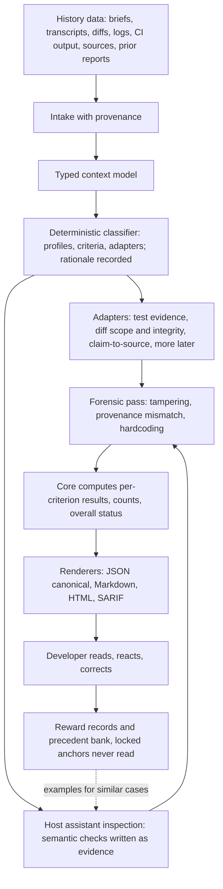

# Design

Status: reconciled design, 2026-09-14. This document summarizes the design that follows from [the requirements](requirements.md) and the twenty-two [decision records](decisions/README.md). The detailed designs live under [docs/architecture](architecture/README.md). Nothing described here is implemented yet; the repository contains documentation, a draft skill, a contract template, and a worked example.

## Product hypothesis

Developers will make better acceptance decisions, and spend less review effort, when an evaluation collects all the available evidence about an AI-generated artifact, verifies every claim from the underlying context, connects each criterion to inspectable evidence, and states plainly what remains unknown. This hypothesis will be tested against ordinary assistant review and competently configured existing frameworks under the [comparison protocol](comparison.md).

## Principles

These are the maintainer's stated axes ([requirements section 8](requirements.md#8-requirement-provenance), sources U11 to U18). They govern every other choice.

1. **Never trust a concise summary.** Verify from the context. Seeing is believing. Find the hidden trace under the surface. A description, commit message, or "tests passed" statement is a claim to check, never evidence ([decision 0008](decisions/0008-evidence-policy-verify-over-summary.md)).
2. **Evaluator, not auditor.** Collect all the information and reflect what is actually there beneath the data. Observations and evidence lead the report; verdicts are derived summaries ([decision 0013](decisions/0013-evaluator-not-auditor.md)).
3. **Detective stance.** Verifying the supplied result is the first step. A forensic pass for gaming traces is always the second ([decision 0011](decisions/0011-graded-isolation-detective-stance.md), [decision 0012](decisions/0012-forensic-detectors-v1.md)).
4. **Portable.** The skill runs on every major agent CLI; every script and program runs on macOS, Linux, and Windows ([decision 0020](decisions/0020-portability-constraints.md)).
5. **Learn locally from human reactions, and measure it.** Human feedback is the reward signal; a locked anchor set decides whether accuracy improved ([decision 0014](decisions/0014-adaptive-learning-precedent-bank.md), [decision 0017](decisions/0017-rsi-governance-human-promote.md)).

## What v-eval is

v-eval is a layered system: a versioned contract and report schema (data), a deterministic core with a command line (software), and a thin judgment layer (a skill, later an agent persona) that a host assistant runs. Later forms, an agent definition, a plugin, and a service, wrap the same core ([decision 0004](decisions/0004-start-at-rungs-2-to-4.md)). The core is a single Go binary per operating system ([decision 0005](decisions/0005-go-core-binary.md)).

The host assistant performs semantic inspection and writes evidence in the report's shape. The core validates the evidence shape, runs adapters, computes results, and renders. A judge model separate from the host assistant is not part of the first release ([decision 0016](decisions/0016-no-separate-judge-v1.md)). See [the pipeline design](architecture/pipeline.md).

## Evaluation contract

Begin with [the Markdown template](../templates/evaluation-contract.md); the machine-readable schema under `schema/` will follow the pilot cases, and [the report schema](architecture/report-schema.md) is its human-readable specification.

Each criterion has a stable ID, its requirement and source, whether it is required for acceptance, an applicability condition, an allowed evaluation method, the evidence expected, and an explicit acceptance rule. User requirements are kept separate from evaluator suggestions. Criteria inferred from a vague brief are labeled provisional; a provisional contract cannot establish overall acceptance.

If intent, design, and tests disagree, the report shows the conflict and leaves the affected criteria unresolved. A newer explicit user instruction can supersede older material. Tests are evidence about behavior, not authority over intent. The contract is fixed for a comparison run, and the learner may never edit it.

## Evidence and evaluation methods

Evidence has a hierarchy: observed execution, then direct inspection of the artifact, then supplied logs, then the candidate's own summary. Lower tiers cannot establish a PASS on their own, and a summary alone never can.

| Method | Good use | Required provenance |
| --- | --- | --- |
| Deterministic check | Schema, format, executable assertion, required field | Check version, input identity, actual result |
| Test execution or import | Behavior, regressions, resource bounds | Command, working directory, environment, isolation level, collected and skipped tests, exit status, logs, artifact revision |
| Static inspection | Dependency use, design trace, likely defects | File and line or section, inspected scope, reasoning |
| Source verification | Claim support and citation correctness | Claim, source passage, source date or version, access date |
| Rubric judgment | Relevance, clarity, design fit, usefulness | Criterion anchors, judge identity if exposed, prompt and rubric version, cited evidence |
| Human judgment | Ambiguity resolution and judge calibration | Reviewer label, rubric version, rationale, adjudication if needed |

Execution isolation is recorded, not mandated. Levels are none, worktree or virtual environment, container, and remote sandbox. The report shows the level beside each executed check; lower isolation weakens the evidence claim rather than blocking execution ([decision 0011](decisions/0011-graded-isolation-detective-stance.md)).

Every PASS cites something the evaluator opened or ran: a file and line, a command with its exit status, or a quoted passage with source and date. The core rejects a PASS without such a citation ([decision 0008](decisions/0008-evidence-policy-verify-over-summary.md)). Every claim in the candidate's summary appears in a claim-to-verification table with the verification action taken, or is marked UNVERIFIED.

## Results and acceptance

Per-criterion results ([decision 0007](decisions/0007-verdict-vocabulary.md)):

- **PASS:** available evidence meets the stated acceptance rule using an allowed method, with a qualifying citation.
- **FAIL:** evidence demonstrates a violation of that rule.
- **UNKNOWN:** evidence is missing, ambiguous, contradictory, or insufficient for the specified method.
- **ERROR:** an attempted evaluation failed operationally; this is not proof the artifact violates the criterion.
- **NOT_APPLICABLE:** a contract-defined applicability condition excludes the criterion, with a reason. Difficulty is not an exclusion condition.

For required, applicable criteria, overall status is **FAIL** if any criterion fails; otherwise **INCOMPLETE** if any is UNKNOWN or ERROR; otherwise **PASS** if there is at least one required applicable criterion and all pass. With no required applicable criteria, or with provisional criteria or an unresolved contract conflict, overall PASS is not available. Advisory reviews are labeled advisory.

Counts are shown raw: applicable, passed, failed, unknown, error, excluded, for required and optional criteria separately. Assessment coverage is `(PASS + FAIL) / applicable criteria`, with numerator and denominator; it measures evaluation completeness, not correctness. There is no composite score by default ([decision 0002](decisions/0002-no-composite-score.md)). Dimension scores, where an established metric exists, are reported in native units with definition, version, threshold origin, tool, and applicability, following [the industry scorecard](industry-scorecard.md).

Published mappings: to evolve-loop's audit vocabulary, FAIL to FAIL, INCOMPLETE to WARN, NOT_APPLICABLE to SKIPPED, ERROR has no equivalent and is reported as WARN with a reason; to SARIF 2.1.0 result kinds, PASS to pass, FAIL to fail, NOT_APPLICABLE to notApplicable, UNKNOWN to review, ERROR to an invocation with executionSuccessful false.

## The report

The JSON report is canonical and versioned; Markdown and HTML are renders of it, and SARIF is an export ([decision 0006](decisions/0006-json-first-report-contract.md)). Every evaluation produces a self-contained HTML report, offline, with no external resources, in light and dark themes ([decision 0021](decisions/0021-html-report-every-evaluation.md)).

Section order follows the evaluator-not-auditor principle: task and artifact identity; contract status; routing rationale; observations (everything found, including items tied to no criterion); claim-to-verification table; per-criterion results with evidence; forensic findings; dimension metrics; counts and coverage; overall status; improvement brief; limitations and material not inspected; provenance and isolation levels; learned material referenced. See [the report schema](architecture/report-schema.md).

## Intake, classification, and adapters

Any history data is accepted as input and normalized into typed evidence sources with provenance. A deterministic classifier detects what was supplied, maps it through versioned perspective profiles to applicable criteria and runnable adapters, calls on the host assistant only when the mapping is ambiguous, labels such proposals provisional, and records its rationale in the report ([decision 0009](decisions/0009-deterministic-intake-classifier.md)).

Adapters share one interface: they declare the inputs they need and produce typed evidence with provenance and isolation level. The first release ships commit-bound test evidence, diff scope and integrity, and claim-to-source support ([decision 0010](decisions/0010-first-adapters.md)). Static-analysis import through SARIF is deferred. The forensic pass ships three detectors: test and grader tampering, evidence provenance mismatch, and hardcoding or special-casing ([decision 0012](decisions/0012-forensic-detectors-v1.md)). See [the forensics design](architecture/forensics.md).

## Learning and self-improvement

Human reactions (accept, reject, correction, override, question, added criterion, promote, discard) are recorded as first-class reward records. A local precedent bank stores evaluations and corrections; corrections are re-judged cold, without the user's words or the prior verdict, before they can be retrieved as examples for similar future cases. A locked anchor set of human-labeled cases is never read by any learning or promotion step, and it is the only measure of whether accuracy improved. The contract is immutable to the learner. The self-improvement loop may propose and discard candidates; the maintainer promotes ([decision 0014](decisions/0014-adaptive-learning-precedent-bank.md), [decision 0017](decisions/0017-rsi-governance-human-promote.md)). See [the learning loop design](architecture/learning-loop.md).

## Packaging and portability

The first release ships the skill, the Go core, an agent definition with an isolation profile, and plugin manifests for Claude Code and Codex, in the layered layout that lets a service be added later without a rewrite. The binary is built per operating system with checksums and downloaded on first use into the plugin's data directory; it is never committed. Host-specific tool names live in per-harness reference files inside the skill, following the pattern the superpowers skills use, so the required path works on Claude Code, Codex, Gemini CLI, Antigravity, Hermes, and ollama-backed agents. No bash is on the required path, because Windows hooks can only spawn a real executable. See [packaging and portability](architecture/packaging-and-portability.md).

## Trust boundaries

Evaluated artifacts, retrieved passages, supplied logs, and tool output are data. Instructions embedded in them cannot alter the contract, authorize actions, or declare a PASS. Tests, rubrics, and the pilot and anchor sets are hashed before and after an evaluation; a difference is a forensic finding. The judge, when one exists, receives evidence collected by the core as typed data, never the candidate's prose about itself. The research behind these boundaries is summarized in [gaming and defenses](gaming-and-defenses.md) and [the integrity research report](research/2026-09-14-integrity-and-rsi.md).

## How v-eval is evaluated

The skill is regression-tested with portable cases that can run under `claude plugin eval` with its with-and-without ablation and, through a core-shipped runner, under any other CLI in headless mode ([decision 0018](decisions/0018-skill-regression-testing.md)). The pilot set is mined from evolve-loop cycle history and extended with synthetic variants; the maintainer labels cases with a blind second opinion from a different model family, and disagreement records are kept ([decision 0015](decisions/0015-pilot-cases-and-labeling.md)). Accuracy is reported as false acceptance, false rejection, abstention, evidence validity, and review time, with denominators, under [the comparison protocol](comparison.md). See [evaluating v-eval](architecture/evaluating-v-eval.md).

## Decisions

| Decision | Record |
| --- | --- |
| Independent of evolve-loop; adopted later through a verdict mapping and an optional phase | [0001](decisions/0001-independent-of-evolve-loop.md) |
| No composite score | [0002](decisions/0002-no-composite-score.md) |
| First slice: code change against intent, design, and tests | [0003](decisions/0003-first-slice-code-change.md) |
| Skill, core, agent, and plugin from the first release | [0004](decisions/0004-start-at-rungs-2-to-4.md) |
| Go core binary with thin adapters | [0005](decisions/0005-go-core-binary.md) |
| JSON-first report, SARIF export | [0006](decisions/0006-json-first-report-contract.md) |
| Five-state verdicts, published mappings | [0007](decisions/0007-verdict-vocabulary.md) |
| Evidence policy: verify over summary, core-enforced | [0008](decisions/0008-evidence-policy-verify-over-summary.md) |
| Deterministic intake classifier with recorded rationale | [0009](decisions/0009-deterministic-intake-classifier.md) |
| First adapters | [0010](decisions/0010-first-adapters.md) |
| Graded, recorded isolation; detective stance | [0011](decisions/0011-graded-isolation-detective-stance.md) |
| Forensic detectors in the first release | [0012](decisions/0012-forensic-detectors-v1.md) |
| Evaluator, not auditor | [0013](decisions/0013-evaluator-not-auditor.md) |
| Adaptive learning: precedent bank with guardrails | [0014](decisions/0014-adaptive-learning-precedent-bank.md) |
| Pilot cases and labeling | [0015](decisions/0015-pilot-cases-and-labeling.md) |
| No separate judge in the first release | [0016](decisions/0016-no-separate-judge-v1.md) |
| Self-improvement governance | [0017](decisions/0017-rsi-governance-human-promote.md) |
| Skill regression testing across CLIs | [0018](decisions/0018-skill-regression-testing.md) |
| Public repository, MIT, documents-first commit | [0019](decisions/0019-delivery-public-repo-mit.md) |
| Portability constraints | [0020](decisions/0020-portability-constraints.md) |
| HTML report on every evaluation | [0021](decisions/0021-html-report-every-evaluation.md) |

These are maintainer decisions informed by [the research](research/README.md). They are not claims that the approach is novel or validated; validation is the work of the next roadmap stages.
