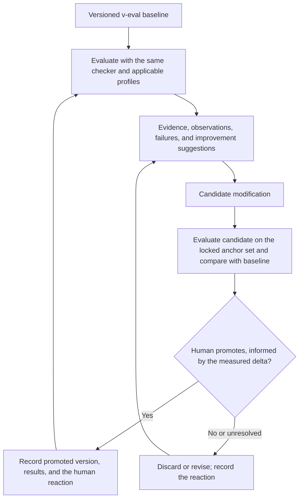

# v-eval requirements

This document consolidates the requirements stated in the project discussion. It was first written from the initial discussion (sources U1 to U10) and extended on 2026-09-14 with the maintainer's further requirements and principles (sources U11 to U19). It is the starting point for the skill's rules, policies, design, and implementation, and it takes priority over earlier proposals.

The requirements below describe the intended product. They do not claim that the current prototype implements them. Decisions taken against these requirements are recorded one per file under [docs/decisions](decisions/README.md); the architecture that follows from them is under [docs/architecture](architecture/README.md); the research that informed them is under [docs/research](research/README.md).

## 1. Product purpose

Build an open-source evaluation program that helps developers determine whether AI-generated work is meaningful, useful, and consistent with its intended purpose and explicit criteria. Its core workflow should be usable as a skill that checks artifacts against intent, design, tests, applicable standards, and supporting evidence.

The program should explain its conclusions, help an AI agent improve the work, and apply its evaluation approach to its own changes. Improvement must be measured over time rather than asserted by the model that made the change.

The program is an evaluator, not a verdict auditor. Its goal is to collect all the available information and reflect what is actually there beneath the data. Verdicts summarize the evidence; they are not the point.

## 2. Explicit requirements

The source labels refer to the discussion excerpts at the end of this document. The descriptions consolidate repeated requests without treating repetition as a separate feature.

### Product and evaluation scope

| ID | Requirement | Source |
| --- | --- | --- |
| REQ-01 | Build an open-source evaluation program for developers. | U1 |
| REQ-02 | Support evaluation of AI-generated content, context, code, documentation, and other relevant project outputs. The concept must extend beyond one output format. | U1, U2, U9 |
| REQ-03 | Determine whether the output is meaningful, useful, and aligned with the requested intent and criteria. For code and projects, connect evaluation to design and tests. | U1 |
| REQ-04 | Provide an evaluation skill as a core interface or workflow for an AI agent. | U1, U9 |
| REQ-05 | Inspect the actual project output, including specified paths, folders, files, and documentation. Evaluation must be grounded in the artifacts being reviewed. | U9 |

### Perspectives, metrics, and explanations

| ID | Requirement | Source |
| --- | --- | --- |
| REQ-06 | Evaluate from multiple useful perspectives, explicitly including security, performance, debuggability, and maintainability, with additional perspectives appropriate to the task. | U3, U6 |
| REQ-07 | Research and use established industry indices and metrics where they apply, covering code quality, effectiveness, performance, and other relevant quality dimensions. | U6, U7 |
| REQ-08 | Provide dimension scores where a meaningful metric or index is defined, together with its definition and the standard or source that establishes it. | U6, U9 |
| REQ-09 | Provide detailed, understandable reasoning for evaluation results and scores. Supply enough relevant context to understand the criterion, observation, interpretation, and conclusion. | U2, U6, U9 |
| REQ-10 | Adapt the evaluation to particular perspectives and criteria so the output can be verified for the intended purpose. | U3, U6 |
| REQ-11 | Include actionable suggestions that an AI agent can use to improve the evaluated output. Evaluation must support correction, not only grading. | U9 |

### Skill obligations and policies

| ID | Requirement | Source |
| --- | --- | --- |
| REQ-12 | Define the skill's rules and policies first, as mandatory obligations governing its evaluation behavior. | U9, U10 |
| REQ-13 | Require the skill to produce sufficient context, evidence-backed reasoning, applicable standard definitions, and inspection of the relevant project artifacts. These must be part of its required workflow and output. | U9 |
| REQ-14 | Research AI gaming, cheating, and manipulation of evaluation, and use the findings to design verification of output and evaluation integrity. | U3 |

### Research and learning material

| ID | Requirement | Source |
| --- | --- | --- |
| REQ-15 | Begin with online research into citations, existing open-source evaluation projects, influential benchmarks, and established measures for documents, code, context, and quality. | U1 |
| REQ-16 | Conduct a deep investigation of evaluation diversity and scoring, including relevant original posts from experienced engineers, AI leaders, social media, and technical blogs. | U4 |
| REQ-17 | Research deterministic tools that can evaluate AI output and investigate current tools and research results from 2026. | U5 |
| REQ-18 | Conduct detailed research into industry standards for code quality, effectiveness, performance, and the broader relevant quality dimensions. | U6, U7 |
| REQ-19 | Create clean, human-readable, detailed learning documentation that explains how evaluation works and why the proposed mechanisms should help. Enable the reader to learn the subject, rather than only operate the tool. | U2, U7 |
| REQ-20 | Explain how v-eval compares with existing solutions and investigate where and how it can outperform them. Any claim of improvement must be supported by comparison evidence. | U2, U10 |
| REQ-21 | Preserve the reference source of truth throughout the documentation: direct links to original posts, papers, official documentation, standards, and PDFs where available. | U7, U8 |

### Measured progress and self-improvement

| ID | Requirement | Source |
| --- | --- | --- |
| REQ-22 | Evaluate v-eval after modifications to determine whether the changes produce measurable progress. | U10 |
| REQ-23 | Support recursive self-improvement: use evaluation findings to improve v-eval over time and evaluate the resulting modifications again. | U10 |
| REQ-24 | Apply the same checker and evaluation approach to v-eval's own outputs and changes. Self-evaluation must be part of the product's use of its own system. | U10 |

### Collaboration and delivery

| ID | Requirement | Source |
| --- | --- | --- |
| REQ-25 | Discuss the findings and design with the maintainer rather than silently treating implementation assumptions as settled requirements. | U1 |
| REQ-26 | Create a GitHub project for the open-source work. | U1 |
| REQ-27 | Write down all requirements first and use the consolidated record to guide the next steps. | U10 |

### Evidence discipline and evaluator stance (added 2026-09-14)

| ID | Requirement | Source |
| --- | --- | --- |
| REQ-28 | Never trust a concise summary. Verify every claim from the underlying context. A summary, description, commit message, or "tests passed" statement is a claim to check, never evidence. Every PASS must cite something the evaluator actually opened or ran. Look for the hidden trace under the surface: what the summary omits, touched tests, skipped checks, empty sections under confident headings. | U11 |
| REQ-29 | Act as a detective, not a gate. Verifying the known result or supplied evidence is only the first step. Every evaluation includes a forensic pass that looks for traces of gaming: modified tests or graders, weakened assertions, skipped or zero-collected tests, hardcoded outputs, logs from another revision, checks planned but never run. | U17 |
| REQ-30 | Be an evaluator, not a verdict auditor. Collect all the information available and reflect what is actually there beneath the data. Observations and evidence lead the report; verdicts are derived summaries. Completeness of collection, including what was not inspected and what remains unknown, is reported with the same prominence as failures. | U18 |
| REQ-31 | Execution isolation is a recorded property of evidence, not a mandatory gate. A virtual environment or worktree is acceptable; a container is not required. The report shows the isolation level next to every executed check, and lower isolation weakens the evidence claim rather than blocking execution. | U17 |

### Generalized intake, adapters, and reports (added 2026-09-14)

| ID | Requirement | Source |
| --- | --- | --- |
| REQ-32 | Accept all history data received for an evaluation as input, not only code: briefs, conversation transcripts, diffs, logs, CI output, retrieved passages, prior reports. Build an abstraction layer that generalizes this context into typed evidence sources. | U15 |
| REQ-33 | Provide a classifier that decides, from the supplied context, which criteria and perspectives apply and which adapters should run. Test cases and test results are one deterministic adapter among many. The routing decision and its rationale are recorded in the report. | U15 |
| REQ-34 | Generate a human-readable HTML report for every evaluation, with a clean and neat structure. The HTML is rendered from the canonical machine-readable report and is self-contained. | U16 |

### Portability (added 2026-09-14)

| ID | Requirement | Source |
| --- | --- | --- |
| REQ-35 | The skill must be general enough to be adapted across all major agent CLIs, explicitly including Claude Code, Codex, Gemini CLI, Antigravity, Hermes Agent, and ollama-backed local agents. Host-specific tool names live in per-harness reference material, not in the required path. | U12 |
| REQ-36 | Every script and program must run on macOS, Linux, and Windows. No bash on the required path; no POSIX-only assumptions in scripts or hooks; Windows in continuous integration from the first commit. | U13 |

### Adaptive learning from human feedback (added 2026-09-14)

| ID | Requirement | Source |
| --- | --- | --- |
| REQ-37 | Design the skill as an adaptive skill that learns from the user's questions, corrections, and accepted or rejected results, and improves accuracy locally on the user's machine. Learned material is data with provenance, versioned separately from the skill text, and never silently merged into the trusted contract. | U14 |
| REQ-38 | Keep the human reaction as the reward signal, in the sense of reinforcement learning from human feedback. Every human reaction is captured as a first-class record with provenance; learning and promotion are driven by that signal, never by the evaluator's or a model's self-assessed score. Improvement is measured on a locked anchor set the learner never reads. | U17 |

### Documentation of research and design (added 2026-09-14)

| ID | Requirement | Source |
| --- | --- | --- |
| REQ-39 | Everything researched and everything designed is written up as detailed documents in the repository: research reports with sources and access dates, one decision record per decision, and architecture documents, all cross-linked from the handbook. | U19 |

## 3. What an evaluation result needs to contain

The following is the report structure implementing REQ-05 through REQ-13 and REQ-28 through REQ-34. The order reflects REQ-30: observations and evidence first, derived verdicts after. Field names are specified in [the report schema](architecture/report-schema.md).

1. **Task and context:** intended outcome, audience, relevant design and constraints, and the criteria being evaluated.
2. **Inspection scope:** project root or supplied artifact, relevant paths and folders, files inspected, version or revision, and material not inspected.
3. **Routing rationale:** which perspectives, criteria, and adapters the classifier selected or skipped, and why.
4. **Observations:** everything found during collection, including items not tied to any criterion, each with a location or quoted passage.
5. **Claim-to-verification table:** every claim made by the candidate's summary, description, or logs, with the verification action taken and its result, or UNVERIFIED.
6. **Definitions and authority:** metric or standard name, version, definition, reference URL, units, and the origin of any acceptance threshold.
7. **Results and evidence:** measured values where available, per-criterion findings, supporting file locations or source passages, actual check results with isolation level, and unresolved evidence.
8. **Forensic findings:** gaming traces observed, each as an observation with evidence, mapped to explicit integrity criteria.
9. **Decision rationale:** a concise explanation connecting the requirement and observation to the result. This means an auditable justification, not a requirement to expose private internal model reasoning.
10. **Agent improvement brief:** the issue, relevant locations, suggested change or missing investigation, constraints to preserve, and how to verify the improvement.
11. **Comparison with a baseline:** when a previous result exists, show changes in measurements, regressions, unresolved checks, and the conditions under which comparison is valid.
12. **Provenance:** artifact identity, contract version, skill and core versions, model identity where exposed, commands, environments, and learned material referenced.

Missing evidence is never filled with invented scores, citations, context, or execution results.

## 4. Self-evaluation and recursive self-improvement

Here RSI means a repeatable process in which v-eval evaluates its own work, uses findings to propose improvements, and measures the revised result. It does not mean that merely generating a new version demonstrates progress.

REQ-22 through REQ-24 require measured progress, iterative improvement, and use of the same checker. REQ-37 and REQ-38 add local learning driven by human reactions. The controls that make the loop trustworthy were decided on 2026-09-14 and are recorded in [decision 0014](decisions/0014-adaptive-learning-precedent-bank.md) and [decision 0017](decisions/0017-rsi-governance-human-promote.md):

| Control | Why it is needed |
| --- | --- |
| Preserve a baseline and version the artifact, criteria, checker, tools, and data. | A changed measurement procedure can make an unchanged product appear better. |
| Compare old and new under the same frozen evaluation setup for a given experiment. | Before and after scores otherwise may not be comparable. |
| Keep a locked anchor set of human-labeled cases that no learning or promotion step ever reads. | A checker cannot establish its own accuracy by awarding itself a better score. |
| Re-judge every correction cold, without the user's words or the prior verdict, before it can become an example. | Preference data rewards agreement; a follow-up rebuttal flips verdicts far more often than the evidence warrants. |
| Protect acceptance rules and reference evidence from the learner; review intentional rule changes separately. | Weakening the evaluator must not count as improving the evaluated artifact. |
| Measure false acceptance, false rejection, missing or invalid evidence, abstention, and cost or review time, with denominators. | A single improving number can hide regressions or excessive refusal. |
| Retain failures, disagreements, discards, and unsuccessful attempts in an append-only log. | Progress needs a reviewable history, not only successful examples. |
| Define iteration budgets, stopping conditions, and promotion authority: the loop may propose and discard, the human promotes. | Recursive improvement needs bounded execution and an explicit rule for adopting changes. |

## 5. Interpretation boundaries

These distinctions preserve the intent of the requirements without promising unsupported capabilities:

- **Broad research:** cover the relevant dimensions and influential sources thoroughly. "All posts" and "everything" express breadth; completeness across the entire internet cannot be verified. Record the selection and gaps.
- **Industry scores:** distinguish formal standards, established metrics, vendor-specific ratings, and project-defined rubrics. Where no general industry index exists, say so. Do not present a locally invented score as a standard. No composite score is produced by default ([decision 0002](decisions/0002-no-composite-score.md)).
- **Multiple perspectives:** select applicable checks and explain exclusions. A performance number cannot compensate for a required security failure simply because both appear in one report.
- **Comparative performance:** document intended advantages and test them. The requirement to investigate outperformance is not evidence that it has already been achieved.
- **Skill enforcement:** mandatory written instructions define expected behavior. Claims of mechanically enforced obligations require implementation and validation; a prompt alone does not guarantee model compliance. The evidence-shape rule and the verdict rollup are enforced by the core, not only the prompt ([decision 0008](decisions/0008-evidence-policy-verify-over-summary.md)).
- **Sources:** distinguish public overviews from full standards text and inaccessible references from inspected sources. Project policies are authored decisions, not automatically industry requirements.
- **Learning:** an adaptive skill that agrees with its user more often has not necessarily become more accurate. Only the locked anchor set can tell the difference.

## 6. Decisions

The decisions that were open in the first version of this document were taken on 2026-09-14 and are recorded under [docs/decisions](decisions/README.md). In summary:

| Decision | Outcome | Record |
| --- | --- | --- |
| First automated use case | Code change against intent, design, and tests; documents and generated context follow through the same intake and adapter interface | [decision 0003](decisions/0003-first-slice-code-change.md), [decision 0010](decisions/0010-first-adapters.md) |
| Programming language | Go core binary, thin adapters where a framework needs them | [decision 0005](decisions/0005-go-core-binary.md) |
| Distribution | Skill plus core CLI plus agent definition plus plugin manifests from the first release; service later | [decision 0004](decisions/0004-start-at-rungs-2-to-4.md) |
| Report contract | JSON-first, Markdown and HTML rendered, SARIF export | [decision 0006](decisions/0006-json-first-report-contract.md), [decision 0021](decisions/0021-html-report-every-evaluation.md) |
| Verdicts and scores | Five-state per-criterion verdicts, overall PASS/FAIL/INCOMPLETE, no composite | [decision 0007](decisions/0007-verdict-vocabulary.md), [decision 0002](decisions/0002-no-composite-score.md) |
| Judges and execution | No separate judge in the first release; graded, recorded isolation; detective stance | [decision 0016](decisions/0016-no-separate-judge-v1.md), [decision 0011](decisions/0011-graded-isolation-detective-stance.md) |
| RSI autonomy | Auto-propose, auto-reject, human-promote; human reaction as reward | [decision 0017](decisions/0017-rsi-governance-human-promote.md), [decision 0014](decisions/0014-adaptive-learning-precedent-bank.md) |
| GitHub deliverable | Public repository `mickeyyaya/v-eval`, documents-first commit | [decision 0019](decisions/0019-delivery-public-repo-mit.md) |
| License | MIT | [decision 0019](decisions/0019-delivery-public-repo-mit.md) |
| Relationship to evolve-loop | Independent; adopted later through a verdict mapping and an optional phase | [decision 0001](decisions/0001-independent-of-evolve-loop.md) |

Still open: the exact metric thresholds and per-project budgets (REQ-07, REQ-08), which are set per contract and per project rather than by the skill; and the timing of the optional judge, which waits for the anchor set.

## 7. Relationship to the current documents

Start with these requirements, then the decision records, then the architecture. The [design](design.md), [roadmap](../ROADMAP.md), and [draft skill](../skills/evaluate-output/SKILL.md) were reconciled with these requirements on 2026-09-14. The [learning handbook](README.md) contains supporting research; its links explain possible methods and standards; they do not supersede the product requirements recorded here. Self-improvement capability and comparative superiority have not been implemented or demonstrated.

## 8. Requirement provenance

The authority for these product requirements is the maintainer's conversation. The excerpts below identify that source; they are not external industry definitions.

| Source | Request captured |
| --- | --- |
| U1 — Initial project request | An open-source evaluation program for meaningful/useful AI content, context, and code; a skill checking intent/design/tests; online research; discussion; GitHub project creation. |
| U2 — Learning and comparison requests | Learn as much as possible about generated-context evaluation; clean, readable, detailed documentation explaining why the approach works and how it can outperform existing solutions. |
| U3 — Gaming and views | Research "AI gaming the system / cheating" and adapt particular evaluation views to verify output context. |
| U4 — Deep practitioner research | Deep investigation of engineers' and AI leaders' posts, social media, and blogs concerning evaluation diversity and scoring. |
| U5 — Deterministic tools and recency | Find deterministic tools for output evaluation and search for the latest 2026 results. |
| U6 — Multiple dimensions and scores | Include security, performance, debuggability, maintainability, useful industry indices, scores, and detailed reasoning. |
| U7 — Industry standards | Deep research into standards for coding quality, effectiveness, performance, and other dimensions; detailed documentation with source links. |
| U8 — Reference preservation | Keep reference sources of truth throughout the documentation, including links, documents, and PDFs. |
| U9 — Mandatory skill behavior | Include improvement suggestions for the AI agent; require enough context and reasoning with standard definitions; scan project paths, folders, and docs; define rules and policies as high obligations first. |
| U10 — Self-evaluation and requirements first | Measure v-eval's progress after modifications; enable RSI over time; use the same checker for itself; "write down all my requirement first." |
| U11 — Verification axis (2026-09-14) | "Don't trust any concise summary, verify and check from the context", "seeing is believing", "Find the hidden trace under the surface". |
| U12 — Cross-CLI portability (2026-09-14) | "the skill needs to be general enough to be adapted through all major CLIs, including antigravity and ollama and etc." |
| U13 — Cross-OS portability (2026-09-14) | "for the script and program, it must be portable across different OSs, such as MacOS, Linux, Windows". |
| U14 — Adaptive skill (2026-09-14) | "would we be able to design this skill as an adaptive skill that could learn from the user questions and improve the accuracy local?" with a request for deep research on evolve and adaptive skill features. |
| U15 — Generalized intake and classifier (2026-09-14) | "think outside of coding with all the history data we received as input for evaluation. Test cases and test result should be just one of deterministic adapter, build a abstract layer to generalize the context and classifier to decide which criterions and adapter should be direct to". |
| U16 — HTML report (2026-09-14) | "make sure every evaluation will generate human readable html report with clean and neat structure format". |
| U17 — Detective stance, isolation, and human feedback (2026-09-14) | "only inside the container standard is too restrict, virtual environment should be good enough but it should not be mandatory, the key is to act as the detective to find the trace of any gaming traces, verify the known result / evidence is just part of first step"; and on the improvement loop: "the most important thing is to keep the human reaction as followed the reinforcement learning from human feedback". |
| U18 — Evaluator, not auditor (2026-09-14) | "you are evaluator, not the verdict auditor, our goal is to collect all the information and reflect the true hidden underneath the data." |
| U19 — Documentation (2026-09-14) | "make sure everything you research and design, write a detailed documents". |
